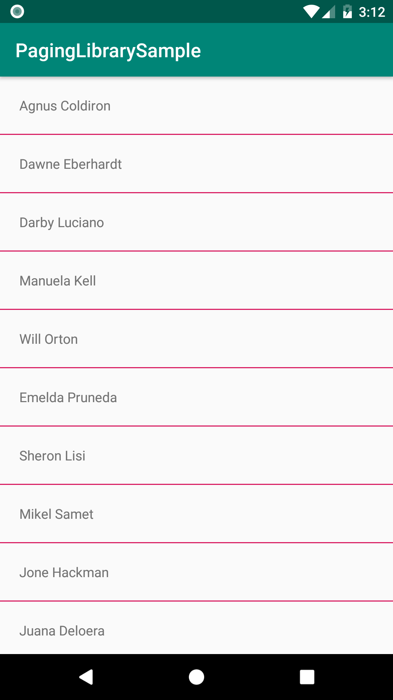

# Paging Library Sample

Simple app that uses [Room](https://developer.android.com/training/data-storage/room/), [LiveData](https://developer.android.com/topic/libraries/architecture/livedata), and [PagedList](https://developer.android.com/reference/android/arch/paging/PagedList) to display a list of names.

### Resources

- [Paging Library with Room Tutorial (in Kotlin)](https://code.tutsplus.com/tutorials/android-architecture-components-using-the-paging-library-with-room--cms-31535)
- [Paging Library Tutorial](https://proandroiddev.com/8-steps-to-implement-paging-library-in-android-d02500f7fffe)
- [Pokedex Example Tutorial](https://medium.com/@husayn.hakeem/android-by-example-googles-recent-android-paging-library-pokedex-d9ec1d4986e9)
- [Pokedex Example Source Code](https://github.com/husaynhakeem/Pokedex-Paging-Library-Sample)